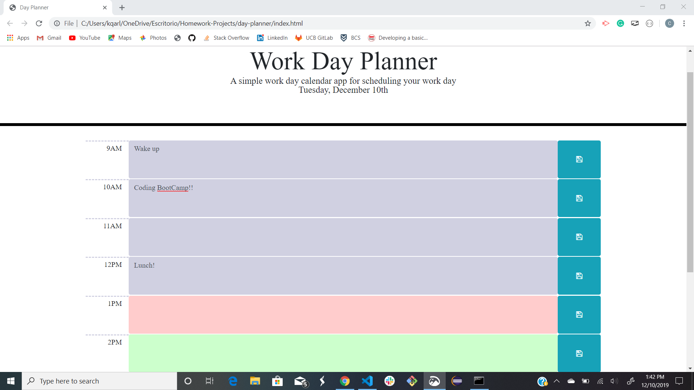
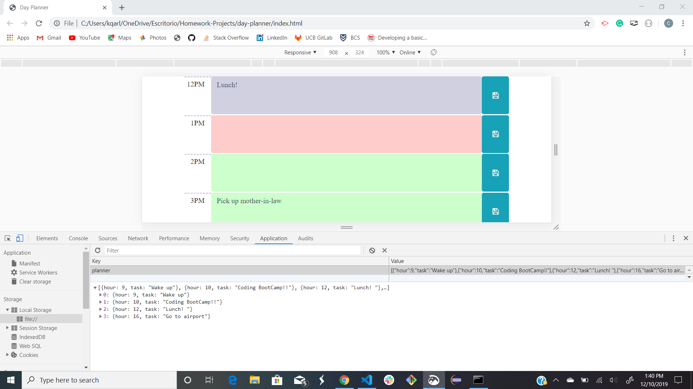
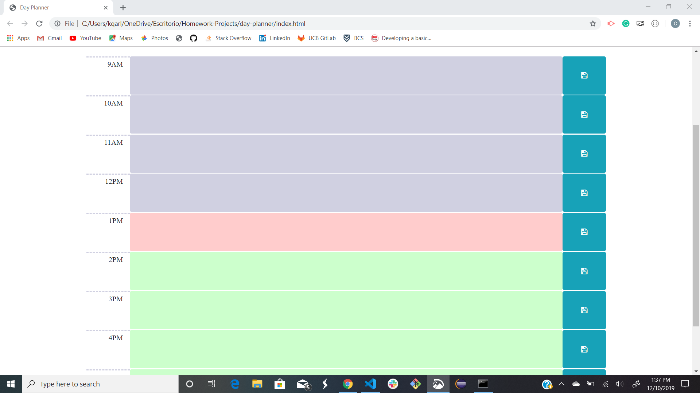

# Day Planner

</br>
<p align="center">
    
    
    
       
       
      
      
      
</p>

## Description

Poor time management can result in missed meetings and deadlines or create the appearance of unprofessionalism. A daily planner allows employees to see their day at a glance, schedule time effectively, and improve productivity. The day planner saves information to local memory and loads it every time the site is called.

## Table of Contents

* [Installation](#installation)
* [Usage](#usage)
    * [Screenshots](#screenshots)
    * [Snippets](#snippets)
* [Credits](#credits)
* [License](#license)


## Installation

This application is compatible with the most commonly used web browsers.

<p align="center">
    <a href="https://kqarlos.github.io/day-planner"></a>
</p>

## Usage 

### Screenshots

1. Site 



1. Local Memory 



1. Color-Coding




### Snippets

1. Set up of timed elements: This functions set ups elements suchs as the current date displayed. This is done through the Moment.js API. The date format is specified in the _format()_. The _currentHour_ is retrieved and used to check against all the elements whose _id_ represents their time. During this comparison we can check wether each element's time is from the past, present or future. The _background-color_ is updated accordingly using JQuery's _.css()_ function.

```javascript

    function setUpTimedElements() {
        updateDate();
        renderTextareaBackground();
    }

    function updateDate() {
        $("#date").text(moment().format("dddd, MMMM Do - h:mm:ss a"));
    }

    function renderTextareaBackground() {
        let currentHour = parseInt(moment().format("H"));
        $("textarea.form-control").each(function (i) {
            let id = parseInt($(this).attr("id"));
            if (id < currentHour) {
                $(this).css("background-color", "rgb(208, 208, 225)");
            } else if (id === currentHour) {
                $(this).css("background-color", "rgb(255, 204, 204)");
            } else {
                $(this).css("background-color", "rgb(204, 255, 204)");
            }
        });
    }

```

2. Save button event listener: This event is placed into all the buttons of the document with a class _btn_. Through event delegation and the use of _$(this)_ we can get the button that was pressed toguether with the id/hour and input. To save the information we first check if it is a new task. If it is not new we just update the _task_ key. If it is a new task, we create one and push it to the planner array. We then update the local storage.

```javascript

    //Saves task upon clicking save button
    $("button.btn").on("click", function () {
        //look for id/hour and input of element. 
        let id = parseInt($(this).data("hour"));
        let input = $(`#${id}`).val();

        // Assume task is new
        let newTask = true;
        for (var i = 0; i < planner.length; i++) {
            //if id is found in planner then is not a new task and we need to update task
            if (planner[i].hour === id) {
                newTask = false;
                planner[i].task = input;
            }
        }
        //if it is a new task update on planner
        if (newTask) {
            addTask(id, input);
        }
        //update planner item on local storage
        localStorage.setItem("planner", JSON.stringify(planner));
    });

```

## Credits 

### Author

- Carlos Toledo: [portfolio](https://professional-portfolio2020.herokuapp.com/)
- Github: [kqarlos](https://www.github.com/kqarlos)
- LinkedIn: [carlos-toledo415](https://www.linkedin.com/in/carlos-toledo415/)

### Built With

<p align="center">
    <a href="https://developer.mozilla.org/en-US/docs/Web/HTML"></a>
    <a href="https://developer.mozilla.org/en-US/docs/Web/CSS"></a>
    <a href="https://www.javascript.com/"></a>
    <a href="https://getbootstrap.com/"></a>
    <a href="https://momentjs.com/docs/"></a>
    <a href="https://jquery.com/"></a>
</p>
</br>

## License

<p align="center">
    
</p>